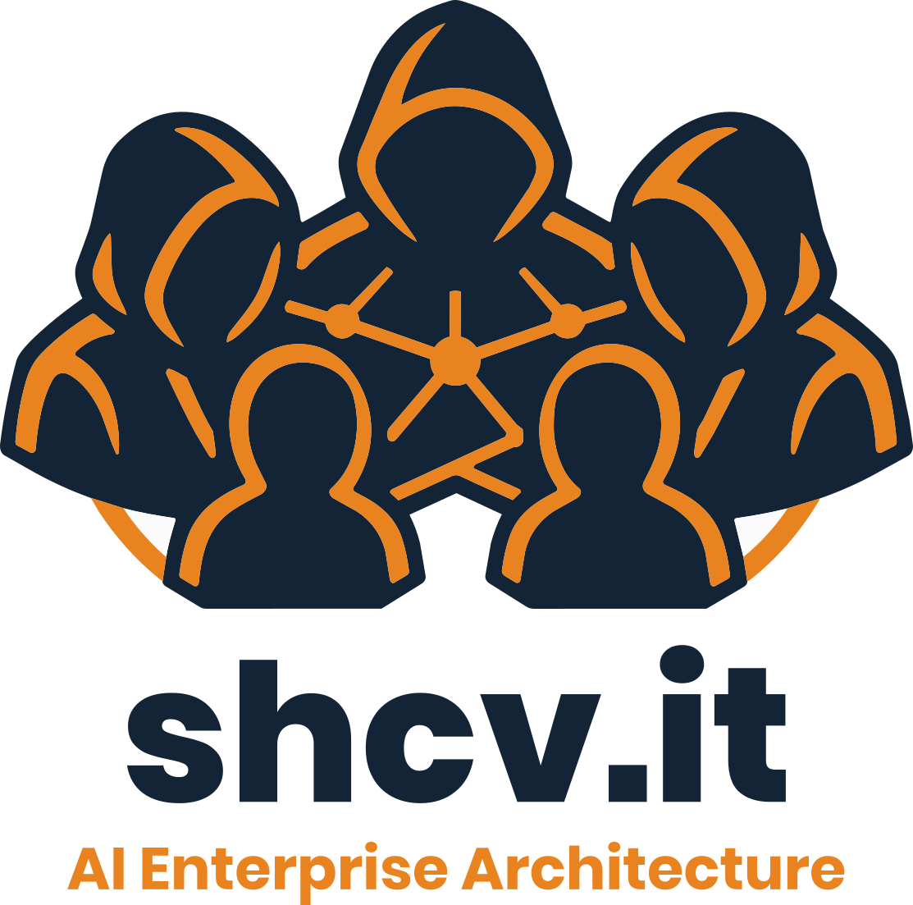

<!--
  SHCV.IT OÜ — GitHub organization profile README
  Location in repo: SHCV-it/.github → profile/README.md
  Logo: commit the SVG to profile/assets/shcv-logo.svg (the site asset URL is
  content-hashed and will break on the next deploy).
-->

# Architecting Human Freedom

**AI-first enterprise architecture for the DACH region and the European Mittelstand.**
We build sovereign, human-centred AI systems that give people their time back.

---

> ### "Technology should give more than it takes."

---

## Who we are

SHCV.IT OÜ is a small, senior engineering company led by **Steffen Hoehne**, an enterprise
architect with 18 years spent designing systems that outlive their hype cycle. We work with
German, Swiss and Austrian organisations that need real AI capability but cannot hand their
data to a US hyperscaler to get it.

So we build the other option: AI that runs inside your walls, under your keys, on your terms.

**Humans drive. Agents execute.** You set direction — the systems we build power the journey.

## What we do

| | |
|---|---|
| **Strategy & Vision** | Aligning business purpose with technology direction, so the advantage is durable rather than seasonal. |
| **Agent Systems** | Orchestrated agentic systems that execute real workflows, augment teams, and hand hours back. |
| **Governance & Trust** | Compliance, privacy and control built into the core — trust that scales alongside innovation. |
| **Open Source & Community** | We build in the open where we can, and contribute back the tools that made our own work possible. |

## Products

Everything below is designed to run where your data already lives: on-premise, in an EU
region, or fully air-gapped.

| Product | What it does |
|---|---|
| **NeuroMark** &nbsp;`flagship` | Airgap-ready intelligent document processing — a universal document intelligence engine for high-volume enterprise automation. |
| **Stimna** | Secure transcription and meeting summarisation, run locally. Speaker identification and structured, actionable minutes in real time. |
| **Tianlu** | The company brain. Unifies scattered documents into one conversational search and answers from your own knowledge, with citations. |
| **LLMeister** | Model management for locally hosted AI — the control plane for your own inference stack. |
| **[Gnosis](https://github.com/SHCV-it/gnosis)** | Crawls entire websites and converts every page into clean, LLM-ready Markdown. Open source. |

<a href="https://calrs.dev.shcv.it/u/admin-calrs/intro"><b>→ Talk to us about any of them</b></a>

## Open source

Tools we built for ourselves and kept in the open.

| Repository | What it is | |
|---|---|---|
| [**gnosis**](https://github.com/SHCV-it/gnosis) | Crawls entire websites and converts every page into clean, LLM-ready Markdown. |   |
| [**ariadne**](https://github.com/SHCV-it/ariadne) | A learning tab-completion brain for the kitty terminal. |  |
| [**psm-cost-per-project-plugin**](https://github.com/SHCV-it/psm-cost-per-project-plugin) | Pi Session Manager plugin that calculates token cost per project. |   |

Issues and pull requests are welcome on every public repository. For anything security-related,
please write to [team@shcv.it](mailto:team@shcv.it) rather than opening a public issue.

## The principles we build on

<table>
<tr>
<td width="20%" align="center"><b>01</b>  <b>The Architect</b> Vision · Mastery · Foundation</td>
<td>We design the blueprint for what others can't yet see.</td>
</tr>
<tr>
<td align="center"><b>02</b>  <b>The Sturdy Oak</b> Sovereignty · Rootedness · Core</td>
<td>Built for resilience. Grounded in your world.</td>
</tr>
<tr>
<td align="center"><b>03</b>  <b>The Walled Lake</b> Trust · Security · Compliance</td>
<td>Sovereign by design. Secure by default.</td>
</tr>
<tr>
<td align="center"><b>04</b>  <b>Breaking the Canopy</b> Liberation · Time · Freedom</td>
<td>We remove the friction so human potential can rise.</td>
</tr>
<tr>
<td align="center"><b>05</b>  <b>The Helm</b> Humans drive · Agents execute</td>
<td>You set direction. Agents power the journey.</td>
</tr>
</table>

## Sovereignty, concretely

Sovereign is a word that gets used loosely. Here is what we mean by it:

- **Your infrastructure.** On-premise, private EU cloud, or fully air-gapped — your choice, not ours.
- **Your keys.** Mandatory end-to-end encryption, with a multi-layered security framework designed in from the start rather than bolted on.
- **Your compliance posture.** GDPR and Swiss DSG obligations met without trading away enterprise-grade performance or support.
- **Your exit.** Open formats and open interfaces, so the architecture is never a hostage situation.

## The people behind the systems

| | Role | Focus |
|---|---|---|
| **Steffen Hoehne** | CEO · Enterprise Architect | Turns complex processes into smarter systems. 18 years of designing better ones. |
| **Olivia Laverick** | Frontend & Design | Systems that look good and feel effortless to use. |
| **Ali Zahid Raja** | Systems & AI | Workflow automation, AI optimisation, and getting ideas into working prototypes fast. |
| **Ismail** | Infrastructure | Keeps critical infrastructure protected, dependable, and calm under load. |

## Work with us

The first step is a direct conversation — no discovery-call theatre.

**[Book 15 minutes →](https://calrs.dev.shcv.it/u/admin-calrs/intro)** &nbsp;·&nbsp; **[team@shcv.it](mailto:team@shcv.it)** &nbsp;·&nbsp; **[shcv.it](https://shcv.it/en/)** &nbsp;·&nbsp; **[LinkedIn](https://www.linkedin.com/company/shcv-it-o%C3%BC/)**

---

**SHCV.IT OÜ** · Männimäe 1, 74626 Kuusalu, Estonia
Registry Code 14942918 · VAT EE102241770 · Tartu County Court Commercial Register

[Imprint](https://www.shcv.it/en/imprint/) · [Privacy](https://www.shcv.it/en/privacy/) · [Impressum](https://www.shcv.it/de/impressum/) · [Datenschutz](https://www.shcv.it/de/datenschutz/)

© 2026 SHCV.IT OÜ — Architecting human freedom.

